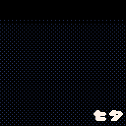
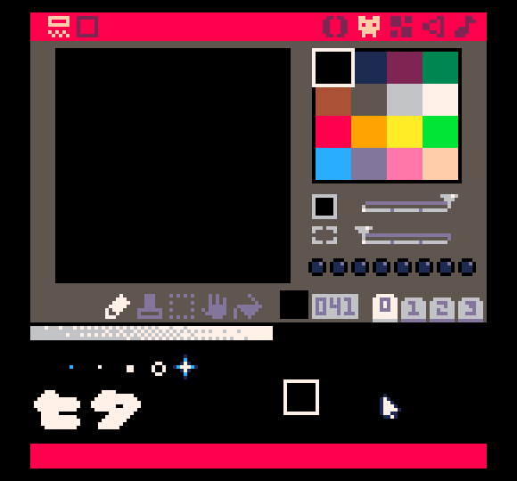

# Everyday One Motion - 20160707 "Tanabata"

PICO-8

[Everyday One Motion](http://motions.work/motion/307)  
[Cartridge](http://www.lexaloffle.com/bbs/?tid=3777)  

## はじめに

7-8月分のソースコードのアップロードを怠っていました。これでは世界平和に貢献できません。大変申し訳ありませんでした。  

## Tanabata

7/7は七夕らしかったので、〆切3時間前に舵を切って七夕ネタでやりました。  
結果、〆切には間に合わないわドット絵は汚いわ笹は笹に見えないわで大惨事でした。  

## PICO-8

さて、7月はテーマとして「 **PICO-8** 」を選択しました。  

PICO-8とは、lexaloffleが開発する、「ファンタジーコンソール」です。  
ファンタジーのため実機を持たない、ある意味バーチャルコンソールとなっています。  
現在、Windows・MacOS・Linuxで動く他、CHIPという9ドルコンピュータ（！）で動かすことができます。  

特徴として、コードエディタの他に、スプライト・マップ・SE・BGMをそれぞれ作れるエディタが用意され、コードでは直感的に作るのが難しい絵や音楽を簡単に作ることができます。  
また、エクスポート機能が豊富で、スクリーンショットはもちろん、GIF吐き出しまでできてしまいます。  
公式のコミュニティに作ったゲーム・プログラムをアップロードすることもでき、なんとWeb上で遊ぶこともできてしまいます。  

しかし、処理速度やメモリ容量や解像度・色数などは、どんなプラットフォーム上で動かしても大変制限されています。  
そのため、最近のコンピュータプログラミングでは要求されないような、洗練されたアルゴリズムやトリックが多く要求されます。  
とはいっても、独自にカスタマイズされたLua言語をベースとしているため、文字列処理やテーブル・配列の処理には強く、ちっとも身動きがとれない！ということにはならないようになっています。

今回のテーマにおいては、このようなPICO-8の持つ「制限」の魅力を最大限引き出すため、私のパソコン（MacBook Pro 13inch）で（約）30FPS（上限）で動くことを条件としています。

## Dithering

それでは、実際にこのような制限下ではどのようなトリックが必要となるでしょうか？  
今回は **色** に焦点を合わせたいと思います。  

PICO-8は色数がたいへん制限され、16色しか出すことができません（たとえそれが1677万色出せるディスプレイの上でも）。  
（ただ、この16色がただの#FF0000などではなく、とても厳選されているため、どのようにつかっても非常にカッコいい色合いを実現することができます）  
このような環境でグラデーション・フェードアウトのような表現をするためには、 **Dithering** というトリックが必要となります。  

[Wikipedia](https://ja.wikipedia.org/wiki/%E3%83%87%E3%82%A3%E3%82%B6) には、  

> ディザ（Dither）とは、量子化誤差（端数）を、単純に丸めるのではなく、全体の量子化誤差が最小化するよう確率を調整して切り捨てまたは切り上げのどちらかをランダムにおこなうためによるゆらぎのことである。そのような一種のノイズ的データを追加する作業および技法はディザリング（Dithering）またはディザ法と呼ばれる。  

……と難しく書いてありますが、やっていることはとても単純です。  
たとえば、灰色を白と黒のみの2色で表現したいときに、ピクセルごとに白を表示するか・黒を表示するか割合を調整し、見かけ上灰色に見せるという手法です。  
人によってはハーフトーンと同様の手法と言ってしまえばわかりやすいかもしれません。  

↑ スプライトテーブル。ディザリングのためのテーブルをスプライトとして用意しています。
